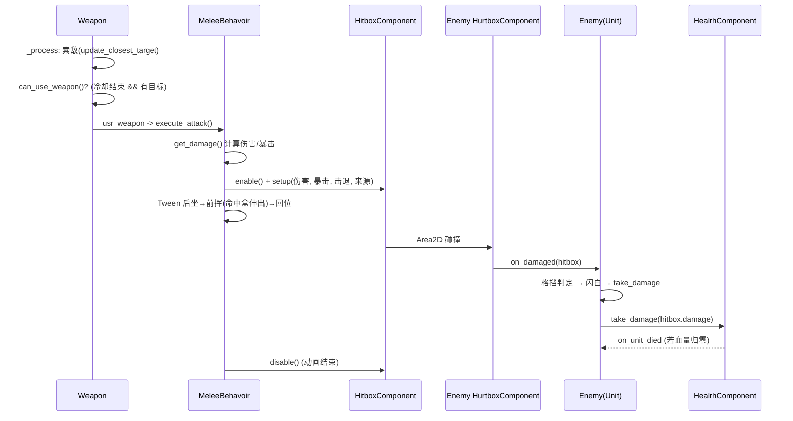
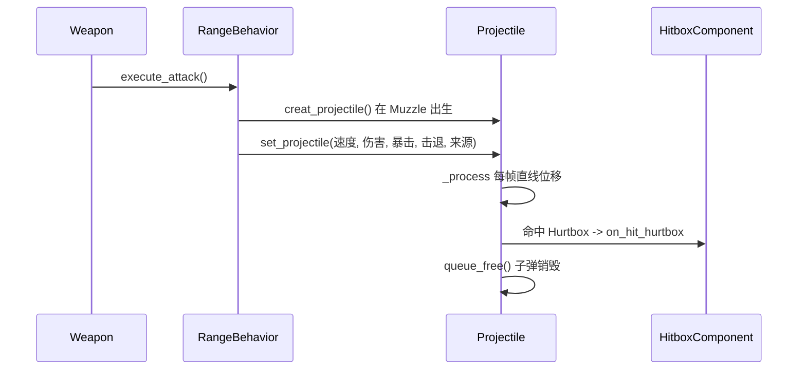

# 游戏角色攻击与射击系统技术文档

> 本文档描述项目中角色（玩家与敌人）的**近战攻击**与**远程射击**功能的实现方式。
> 涵盖架构设计、碰撞层规划、攻击触发流程、伤害结算、弹道系统以及敌人的两种攻击行为。

---

## 目录

1. [系统概览](#1-系统概览)
2. [核心架构](#2-核心架构)
3. [碰撞层设计](#3-碰撞层设计)
4. [数据资源：武器与属性](#4-数据资源武器与属性)
5. [武器装配流程](#5-武器装配流程)
6. [武器驱动逻辑（每帧）](#6-武器驱动逻辑每帧)
7. [攻击行为：近战与远程](#7-攻击行为近战与远程)
8. [弹道系统 Projectile](#8-弹道系统-projectile)
9. [伤害结算与生命组件](#9-伤害结算与生命组件)
10. [敌人攻击行为](#10-敌人攻击行为)
11. [完整时序流程](#11-完整时序流程)
12. [关键参数速查表](#12-关键参数速查表)

---

## 1. 系统概览

本项目的战斗系统采用 **“组件化 + 资源驱动 + 行为多态”** 的设计：

- **组件化**：攻击判定（`HitboxComponent`）、受击判定（`HurtboxComponent`）、生命（`HealrhComponent`）均为独立的 `Area2D` 组件，可挂载到任意单位。
- **资源驱动**：武器的所有数值由 `WeaponStats`（自定义 `Resource`）定义，武器实体由 `ItemWeapon`（资源）引用场景与数值。
- **行为多态**：`WeaponBehavior` 作为攻击行为基类，派生出 `MeleeBehavoir`（近战）与 `RangeBehavior`（远程），由武器的 `WeaponBehavior` 子节点决定具体攻击方式。

```text
Unit（单位基类）
 ├── Player（玩家）
 │     └── WeaponContainer（武器容器，管理多把武器位置）
 │           └── Weapon（武器基类）
 │                 ├── Sprite2D / RangeArea / CooldownTimer
 │                 └── WeaponBehavior（攻击行为）
 │                       ├── MeleeBehavoir（近战）
 │                       └── RangeBehavior（远程，含 Muzzle 枪口）
 └── Enemy（敌人）
       └── ShootingBehavior / ChargeBehavior（敌人专用行为节点）
```

---

## 2. 核心架构

### 2.1 主要类与文件

| 类名 | 文件路径 | 职责 |
| --- | --- | --- |
| `Unit` | `scripts/unit.gd` | 单位基类，统一处理受击、格挡、闪白、伤害结算 |
| `Player` | `scripts/player.gd` | 玩家：移动、冲刺、武器装配 |
| `Enemy` | `scripts/enemy.gd` | 敌人：寻敌、群聚分离、击退 |
| `Weapon` | `scenes/weapon/weapon.gd` | 武器基类：索敌、旋转、冷却、触发攻击 |
| `WeaponBehavior` | `scripts/weapon_behavior.gd` | 攻击行为基类：伤害/暴击计算、吸血 |
| `MeleeBehavoir` | `scripts/melee_behavior.gd` | 近战行为：挥砍动画 + 命中盒开关 |
| `RangeBehavior` | `scenes/weapon/range/range_behavior.gd` | 远程行为：生成弹道 + 后坐力 |
| `Projectile` | `scenes/projectile/projectile.gd` | 弹道：直线飞行、命中/出屏销毁 |
| `WeaponContainer` | `scripts/weapon_container.gd` | 按武器数量布局多把武器位置 |
| `HitboxComponent` | `scripts/hitbox_component.gd` | 攻击判定盒（Area2D） |
| `HurtboxComponent` | `scripts/hurtbox_component.gd` | 受击判定盒（Area2D） |
| `HealrhComponent` | `scripts/health_component.gd` | 生命组件：受伤、治疗、死亡 |
| `WeaponStats` | `scripts/weapon_stats.gd` | 武器数值资源 |
| `UnitStats` | `resources/units/unit_stats.gd` | 单位属性资源 |
| `ItemWeapon` | `scripts/item_weapon.gd` | 武器物品资源（引用场景 + 数值） |

### 2.2 场景继承关系

- `scenes/unit.tscn` 是单位通用场景（含 `Visuals`、`HurtboxComponent`、`HealthComponent`、`AnimationPlayer` 等），玩家与敌人场景均以此为基。
- `scenes/weapon/weapon_base.tscn` 是武器通用场景（含 `Sprite2D`、`RangeArea`、`CooldownTimer`、`WeaponBehavior` 占位），近战与远程武器场景均以此为基，替换 `Sprite2D` 贴图并绑定具体 `WeaponBehavior` 脚本。

---

## 3. 碰撞层设计

项目通过 **6 个物理层** 严格区分攻击者与受击者，避免“自己的攻击打到自己”。

| 层序号 | 名称 | 二进制值 | 十进制值 | 用途 |
| --- | --- | --- | --- | --- |
| 1 | `Player` | 1 | 1 | 玩家本体 |
| 2 | `Enemy` | 2 | 2 | 敌人本体 |
| 3 | `HitboxEnemy` | 4 | 4 | 敌人的攻击判定盒 / 子弹 |
| 4 | `HurtboxEnemy` | 8 | 8 | 敌人的受击判定盒 |
| 5 | `HitboxPlayer` | 16 | 16 | 玩家的攻击判定盒 / 子弹 |
| 6 | `HurtboxPlayer` | 32 | 32 | 玩家的受击判定盒 |

**判定盒的 layer / mask 配置**（关键规则：**命中盒只检测对方的受击盒**）：

| 节点 | collision_layer | collision_mask | 说明 |
| --- | --- | --- | --- |
| 玩家武器命中盒（近战） | 16 `HitboxPlayer` | 8 `HurtboxEnemy` | 检测敌人受击盒 |
| 玩家子弹（手枪） | 16 `HitboxPlayer` | 8 `HurtboxEnemy` | 检测敌人受击盒 |
| 玩家受击盒 | 32 `HurtboxPlayer` | 4 `HitboxEnemy` | 检测敌人命中盒 |
| 敌人子弹 | 4 `HitboxEnemy` | 32 `HurtboxPlayer` | 检测玩家受击盒 |
| 敌人受击盒 | 8 `HurtboxEnemy` | 16 `HitboxPlayer` | 检测玩家命中盒 |

> 判定盒的 `monitoring / monitorable` 在默认是关闭的，攻击时由 `HitboxComponent.enable()` 打开，攻击结束 `disable()` 关闭（见第 9 节）。

---

## 4. 数据资源：武器与属性

### 4.1 `WeaponStats`（武器数值，`scripts/weapon_stats.gd`）

| 字段 | 默认值 | 说明 |
| --- | --- | --- |
| `damage` | 1.0 | 基础伤害 |
| `accuracy` | 0.9 | 精度（0~1，越小散布越大） |
| `cooldown` | 1.0 | 攻击冷却（秒） |
| `crit_channce` | 0.05 | 暴击率（0~1） |
| `crit_damage` | 1.5 | 暴击倍率 |
| `max_range` | 150 | 最大攻击范围（像素） |
| `knockback` | 0 | 击退力度 |
| `life_steal` | 0.0 | 吸血概率（0~1） |
| `recoil` | 25 | 后坐位移（像素） |
| `recoil_duration` | 0.1 | 后坐时间 |
| `attack_duration` | 0.2 | 前挥时间（近战） |
| `back_duration` | 0.15 | 回位时间（近战） |
| `projectile_scene` | — | 弹道场景（远程） |
| `projectile_speed` | 1600 | 弹道速度 |

### 4.2 `ItemWeapon`（武器物品，`scripts/item_weapon.gd`）

```gdscript
enum WeaponType { MELEE, RANGE }
@export var type: WeaponType      # 近战 / 远程
@export var scene: PackedScene    # 武器场景
@export var stats: WeaponStats    # 数值
@export var upgrade_to: ItemWeapon # 升级指向的下一级武器
```

### 4.3 `UnitStats`（单位属性，`resources/units/unit_stats.gd`）

包含 `health`、`damage`、`speed`、`luck`、`block_chance`（格挡）、`life_steal`、`hp_regen` 等字段。玩家攻击的最终伤害 = **武器伤害 + 玩家 `stats.damage`**。

---

## 5. 武器装配流程

1. 玩家在 `_ready()` 中通过 `add_weapon()` 装配武器：

   ```gdscript
   # scripts/player.gd
   func _ready() -> void:
       super._ready()
       add_weapon(preload("uid://bv0o060v0ikpp"))  # 默认装配拳头
   ```

2. `add_weapon(data: ItemWeapon)` 的步骤：

   ```gdscript
   func add_weapon(data: ItemWeapon) -> void:
       var weapon := data.scene.instantiate() as Weapon  # 实例化武器场景
       add_child(weapon)                                 # 挂到玩家下
       weapon.setup_weapon(data)                         # 初始化数据
       current_weapons.append(weapon)                    # 记录到武器列表
       weapon_container.update_weapons_position(current_weapons)  # 重新布局
   ```

3. `Weapon.setup_weapon()` 将 `ItemWeapon` 绑定到武器，并用 `max_range` 设置索敌范围圆的半径：

   ```gdscript
   func setup_weapon(data: ItemWeapon) -> void:
       self.data = data
       collision_shape_2d.shape.radius = data.stats.max_range
   ```

4. `WeaponContainer` 根据武器数量，将多把武器均匀分布到预设的环绕标记点上（支持 1~6 把）。

---

## 6. 武器驱动逻辑（每帧）

武器实体在 `Weapon._process(delta)` 中自主运行，无需玩家手动触发：

```gdscript
func _process(delta: float) -> void:
    if Global.game_paused: return            # 暂停时不处理

    if not is_attacking:                     # 非攻击状态下刷新索敌
        if targets.size() > 0:
            update_closest_target()
        else:
            closest_target = null

    rotate_to_target()                       # 旋转指向目标
    update_visuals()                         # 根据朝向翻转贴图

    if can_use_weapon():                     # 满足条件则攻击
        usr_weapon()
```

### 6.1 索敌 `targets`

- 武器场景内置一个 `RangeArea`（`Area2D`，`collision_mask = 2` 即 Enemy 层），通过 `area_entered / area_exited` 信号维护 `targets` 列表。
- `get_closest_target()` 遍历 `targets` 找到距离最近的敌人，存入 `closest_target`。

### 6.2 攻击触发条件 `can_use_weapon()`

```gdscript
func can_use_weapon() -> bool:
    return cooldown_timer.is_stopped() and closest_target
```

即：**冷却结束 + 存在有效最近目标**。

### 6.3 攻击入口 `usr_weapon()`

```gdscript
func usr_weapon() -> void:
    calculate_spread()                       # 计算随机散布（精度影响）
    weapon_behavior.execute_attack()         # 委托给具体行为
    cooldown_timer.wait_time = data.stats.cooldown
    cooldown_timer.start()                   # 进入冷却
```

### 6.4 散布 `calculate_spread()`

```gdscript
func calculate_spread() -> void:
    weapon_spread += randf_range(-1 + data.stats.accuracy, 1 - data.stats.accuracy)
    rotation += weapon_spread
```

精度 `accuracy` 越接近 1，随机散布区间越小，弹道越准。

---

## 7. 攻击行为：近战与远程

### 7.1 基类 `WeaponBehavior`（`scripts/weapon_behavior.gd`）

攻击行为基类提供两个公共方法：

**① `get_damage()` —— 计算最终伤害与暴击**

```gdscript
func get_damage() -> float:
    var damage := weapon.data.stats.damage + Global.player.stats.damage
    var crit_chance := weapon.data.stats.crit_channce
    if Global.get_chance_sucesss(crit_chance):       # 暴击判定
        critical = true
        damage = ceil(damage * weapon.data.stats.crit_damage)
    return damage
```

**② `apply_life_steal()` —— 吸血判定**

```gdscript
func apply_life_steal() -> void:
    var steal_chance := (Global.player.stats.life_steal / 100) + weapon.data.stats.life_steal
    var can_steal := Global.get_chance_sucesss(steal_chance)
    if can_steal and is_instance_valid(Global.player):
        Global.player.health_component.heal(1.0)
        Global.on_create_block_text.emit(Global.player, 1.0)
```

### 7.2 近战攻击 `MeleeBehavoir`（`scripts/melee_behavior.gd`）

近战通过 **Tween 动画 + 命中盒开关** 实现挥砍：

```gdscript
func execute_attack() -> void:
    weapon.is_attacking = true
    var tween := create_tween()

    # 1. 后坐：武器向后位移
    var recoil_pos := Vector2(weapon.atk_start_pos.x - weapon.data.stats.recoil, weapon.atk_start_pos.y)
    tween.tween_property(weapon.sprite, "position", recoil_pos, weapon.data.stats.recoil_duration)

    # 2. 打开命中盒并写入伤害信息
    hitbox.enable()
    hitbox.setup(get_damage(), critical, weapon.data.stats.knockback, weapon.get_parent())

    # 3. 前挥：武器向前伸出到攻击范围
    var attack_pos := Vector2(weapon.atk_start_pos.x + weapon.data.stats.max_range, weapon.atk_start_pos.y)
    tween.tween_property(weapon.sprite, "position", attack_pos, weapon.data.stats.attack_duration)

    apply_life_steal()

    # 4. 回位
    tween.tween_property(weapon.sprite, "position", weapon.atk_start_pos, weapon.data.stats.back_duration)

    # 5. 动画结束：关闭命中盒，攻击结束
    tween.finished.connect(func():
        hitbox.disable()
        weapon.is_attacking = false
        critical = false
    )
```

> 关键点：**伤害并非逐帧结算，而是由命中盒在 `enable()` 期间与敌人受击盒发生 `Area2D` 碰撞，由信号驱动结算一次**。

### 7.3 远程射击 `RangeBehavior`（`scenes/weapon/range/range_behavior.gd`）

远程通过 **生成子弹 + 后坐力动画** 实现射击：

```gdscript
func execute_attack() -> void:
    weapon.is_attacking = true
    creat_projectile()                          # 生成子弹

    var tween := create_tween()
    var attack_pos := Vector2(weapon.atk_start_pos.x - weapon.data.stats.recoil, weapon.atk_start_pos.y)
    tween.tween_property(weapon.sprite, "position", attack_pos, weapon.data.stats.recoil_duration)
    tween.tween_property(weapon.sprite, "position", weapon.atk_start_pos, weapon.data.stats.recoil_duration)

    apply_life_steal()

    await tween.finished
    weapon.is_attacking = false
    critical = false
```

### 7.4 子弹生成 `creat_projectile()`

```gdscript
func creat_projectile() -> void:
    var instance := weapon.data.stats.projectile_scene.instantiate() as Projectile
    get_tree().root.add_child(instance)                       # 挂到根节点，脱离武器避免随武器旋转
    instance.global_position = muzzle.global_position         # 从枪口 Marker2D 出生

    var velocity := Vector2.RIGHT.rotated(weapon.rotation) * weapon.data.stats.projectile_speed
    instance.set_projectile(velocity, get_damage(), critical, weapon.data.stats.knockback, weapon.get_parent())
```

> `Muzzle` 是远程武器场景中挂在 `Sprite2D` 下的 `Marker2D`（如 `weapon_pistol.tscn` 中位置 `(96, -30)`），作为枪口发射点。

---

## 8. 弹道系统 Projectile

`scenes/projectile/projectile.gd` 实现直线飞行子弹：

```gdscript
extends Node2D
class_name Projectile
@export var hitbox: HitboxComponent

var velocity: Vector2

func _process(delta: float) -> void:
    position += velocity * delta               # 每帧直线位移

func set_projectile(velocity, damage, critical, knockback, unit) -> void:
    self.velocity = velocity
    rotation = velocity.angle()                # 旋转贴图朝向飞行方向
    if hitbox:
        hitbox.setup(damage, critical, knockback, unit)   # 命中盒携带伤害信息
```

子弹销毁时机（两个信号）：

1. **出屏**：`VisibleOnScreenNotifier2D` 的 `screen_exited` 信号 → `queue_free()`。
2. **命中**：命中盒 `on_hit_hurtbox` 信号 → `queue_free()`（子弹一次性，命中即消失）。

子弹场景（`projectile_pistol.tscn` / `projectile_enemy.tscn`）结构：

```text
Projectile (Node2D)
 ├── Sprite2D（贴图）
 ├── VisibleOnScreenNotifier2D（出屏检测）
 └── HitboxComponent（攻击判定盒，碰撞层见第 3 节）
```

---

## 9. 伤害结算与生命组件

### 9.1 命中检测链路

命中采用 **“双向信号 + 单向结算”** 的方式：

```text
HitboxComponent（攻击方 Area2D）  检测到  HurtboxComponent（受击方 Area2D）
        │  _on_area_entered                       │  _on_area_entered
        ▼                                          ▼
 emit on_hit_hurtbox(hurtbox)             emit on_damaged(hitbox)
        │                                          │
        │（子弹场景用它销毁自己）                    │（单位用它结算伤害）
```

**`HurtboxComponent`**（`scripts/hurtbox_component.gd`）：

```gdscript
func _on_area_entered(area: Area2D) -> void:
    if area is HitboxComponent:
        on_damaged.emit(area)
```

**`HitboxComponent`**（`scripts/hitbox_component.gd`）的关键点：

```gdscript
func enable() -> void:   # 攻击时打开检测
    set_deferred("monitoring", true)
    set_deferred("monitorable", true)

func disable() -> void:  # 攻击结束关闭检测
    set_deferred("monitoring", false)
    set_deferred("monitorable", false)

func setup(damage, critical, knockback, source) -> void:  # 写入本次攻击数据
    self.damage = damage
    self.critical = critical
    knockback_power = knockback
    self.source = source
```

### 9.2 单位受击 `Unit._on_hurtbox_component_on_damaged()`

```gdscript
# scripts/unit.gd
func _on_hurtbox_component_on_damaged(hitbox: HitboxComponent) -> void:
    if health_component.current_health <= 0:          # 已死亡不再结算
        return

    var blocked := Global.get_chance_sucesss(stats.block_chance / 100)  # 格挡判定
    if blocked:
        Global.on_create_block_text.emit(self)         # 显示“格挡”文本
        return

    set_flash_material()                               # 受击闪白
    health_component.take_damage(hitbox.damage)        # 扣除生命
    Global.on_create_damage_text.emit(self, hitbox)    # 显示伤害数字
```

### 9.3 敌人额外处理击退

`Enemy._on_hurtbox_component_on_damaged()` 在基类基础上追加击退：

```gdscript
func _on_hurtbox_component_on_damaged(hitbox: HitboxComponent) -> void:
    super._on_hurtbox_component_on_damaged(hitbox)
    if hitbox.knockback_power > 0:
        var dir := hitbox.source.global_position.direction_to(global_position)
        apply_knockback(dir, hitbox.knockback_power)
```

击退在 `Enemy._process()` 的移动中叠加：`position += (get_move_direction() + knockback_dir * knockback_power) * stats.speed * delta`，并由 `KnockbackTimer` 定时重置。

### 9.4 生命组件 `HealrhComponent`

- `take_damage(value)`：扣血（下限 0），血量归零时 `emit on_unit_died` 并调用 `die()`（`owner.queue_free()` 销毁单位）。
- `heal(amount)`：回血（上限 `max_health`），用于吸血与回血。
- `setup(stats)`：用 `UnitStats.health` 初始化生命上限。

---

## 10. 敌人攻击行为

敌人的攻击不通过 `Weapon` 系统，而是由敌人场景中的**独立行为节点**驱动。

### 10.1 射击敌人 `ShootingBehavior`（`scenes/enemy/shooting_behavior.gd`）

实现“扇形弹幕”射击：

```gdscript
func _process(delta: float) -> void:
    if current_cooldown > 0:
        current_cooldown -= delta
    else:
        shoot()
        current_cooldown = cooldown

func shoot() -> void:
    enemy.can_move = false                     # 射击时定身
    var direction := enemy.global_position.direction_to(Global.player.global_position)
    var start_angle := -arc_angle / 2.0
    var angle_step := arc_angle / float(projectile_count - 1 if projectile_count > 1 else 0.0)

    for i in range(projectile_count):          # 生成多颗子弹，呈扇形分布
        var projectile := projectile_scene.instantiate() as Projectile
        get_tree().root.add_child(projectile)
        projectile.global_position = fire_pos.global_position
        var rotated_direction := direction.rotated(deg_to_rad(start_angle + angle_step * i))
        projectile.set_projectile(rotated_direction * projectile_speed,
                                  enemy.stats.damage, false, 0, enemy)

    await get_tree().create_timer(1).timeout   # 1 秒硬直后恢复移动
    enemy.can_move = true
```

可配置参数：`cooldown`（冷却）、`projectile_count`（子弹数）、`arc_angle`（扇形夹角）、`projectile_scene`、`projectile_speed`、`fire_pos`（枪口）。

### 10.2 冲锋敌人 `ChargeBehavior`（`scenes/enemy/charge_behavior.gd`）

实现“蓄力 → 直线冲锋”的攻击：

```gdscript
func _process(delta: float) -> void:
    if is_charging:
        # 以 5 倍速朝锁定位置冲锋
        enemy.global_position = enemy.global_position.move_toward(charge_attack_position, (enemy.stats.speed * 5) * delta)
        if enemy.global_position.distance_to(charge_attack_position) < 50:
            end_charge()
    else:
        if current_cooldown > 0:
            current_cooldown -= delta
        else:
            if is_instance_valid(Global.player):
                charge_attack_position = Global.player.global_position  # 锁定玩家当前位置
                start_charge()

func start_charge() -> void:
    enemy.can_move = false
    anim_effects.play("charge")                 # 蓄力前摇动画（变色闪烁）
    await anim_effects.animation_finished
    is_charging = true
```

> 冲锋敌人本身没有命中盒伤害（`damage` 通过碰撞自行结算），当前实现侧重于**位移攻击**，伤害由 `Enemy` 的 `stats.damage` 或后续接触判定补充。

---

## 11. 完整时序流程

玩家近战攻击的完整时序：



玩家远程射击的完整时序：



---

## 12. 关键参数速查表

### 12.1 武器数值资源（`WeaponStats`）示例

以 `resources/items/weapon/range/pistol/stats_pistol_1.tres` 为例：

```gdscript
max_range = 600                     # 手枪射程更远
projectile_scene = projectile_pistol.tscn
# 其余字段使用 WeaponStats 默认值
```

### 12.2 攻击相关字段汇总

| 机制 | 来源字段 | 说明 |
| --- | --- | --- |
| 伤害 | `WeaponStats.damage` + `UnitStats.damage` | 武器伤害 + 玩家基础伤害 |
| 暴击 | `WeaponStats.crit_channce` / `crit_damage` | 概率判定，命中时翻倍 |
| 击退 | `WeaponStats.knockback` | 仅敌人受击时生效 |
| 吸血 | `UnitStats.life_steal` / `WeaponStats.life_steal` | 概率回复 1 点生命 |
| 格挡 | `UnitStats.block_chance` | 受击方概率免伤 |
| 精度/散布 | `WeaponStats.accuracy` | 影响旋转散布 |
| 攻速 | `WeaponStats.cooldown` | 两次攻击间隔 |

---

## 附：相关文件清单

**玩家武器相关**

- `scripts/player.gd` — 玩家装配武器
- `scripts/weapon_container.gd` — 多武器布局
- `scenes/weapon/weapon.gd` — 武器基类
- `scenes/weapon/weapon_base.tscn` — 武器通用场景
- `scripts/weapon_behavior.gd` — 攻击行为基类
- `scripts/melee_behavior.gd` — 近战行为
- `scenes/weapon/range/range_behavior.gd` — 远程行为
- `scenes/weapon/weapon_punch.tscn` / `weapon_sword.tscn` — 近战武器场景
- `scenes/weapon/range/weapon_pistol.tscn` — 远程武器场景

**弹道与判定**

- `scenes/projectile/projectile.gd` — 子弹
- `scenes/projectile/projectile_pistol.tscn` / `projectile_enemy.tscn` — 子弹场景
- `scripts/hitbox_component.gd` — 攻击判定
- `scripts/hurtbox_component.gd` — 受击判定
- `scripts/health_component.gd` — 生命组件

**敌人攻击**

- `scenes/enemy/shooting_behavior.gd` — 扇形射击
- `scenes/enemy/charge_behavior.gd` — 冲锋
- `scenes/enemy/enemy_shooter.tscn` / `enemy_charger.tscn` — 敌人场景

**资源**

- `scripts/weapon_stats.gd` — 武器数值
- `resources/units/unit_stats.gd` — 单位属性
- `scripts/item_weapon.gd` — 武器物品
- `resources/items/weapon/**` — 武器物品与数值实例
